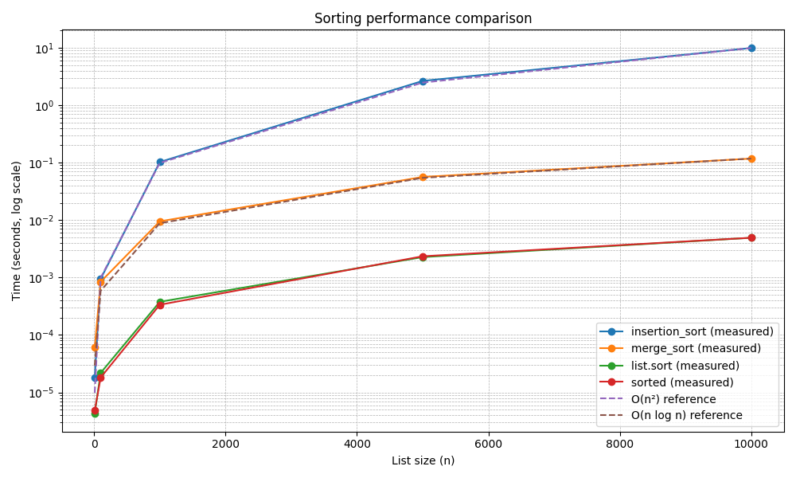

Було проведено порівняння трьох різних алгоритмів сортування за часовими характеристиками.

Отримані результати показали, що найшвидшим за часом виконання є метод  sorted, list.sort() з вбудованої бібліотеки Python.  
Алгоритми (сортування вставками та злиттям), які написані самостійно, показали, що їх часова складність збігається з теоретичною.
Отже, можна зробити висновок, що методи сортування, які вбудовані в Python є оптимізовані і демонструють високу швидкість в порівнянні з написаними власноруч. Це не означає, що варто завжди користуватися внутрішніми методами, а скоріше, в першу чергу, необхідно перевірити чи задовольняє наявний функціонал вашим вимогам, і якщо ні, то тільки тоді шукати сторонні рішення, або розробляти власні.